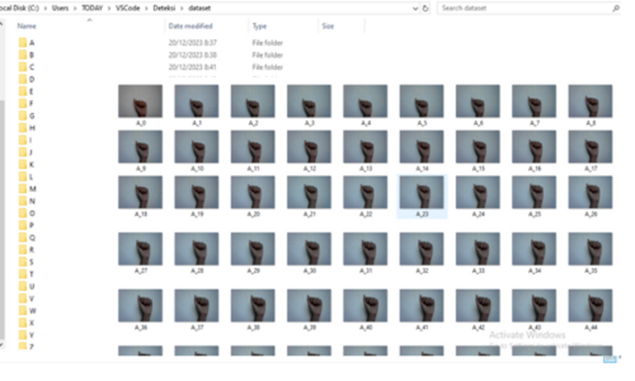

sistem pengenalan bahasa isyarat abjad untuk mengklasifikasikan peragaan bahasa isyarat berdasarkan kelas abjad secara real-time. Sehingga penyandang tuna rungu mamou memperagakan bahasa isyarat secara langsung melalui webcam.
Dataset dibuat dengan american sign language alfabet A-Z, berikut hasil pengumpulan dataset :

Model yang dipakai adalah MobileNetV2. MobileNetV2 adalah arsitektur model neural network yang dirancang khusus untuk keperluan pengolahan citra di perangkat mobile atau berkinerja rendah. Model ini dikenal efisien dan ringan sehingga sangat cocok untuk aplikasi di perangkat mobile. 
Berikut tampilan aplikasi : 

